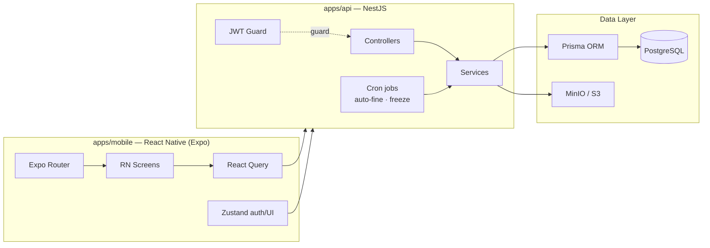
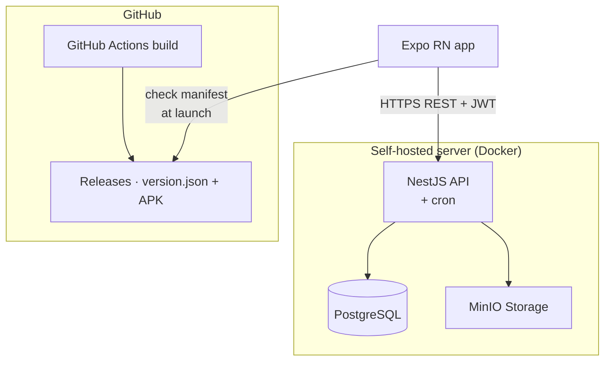
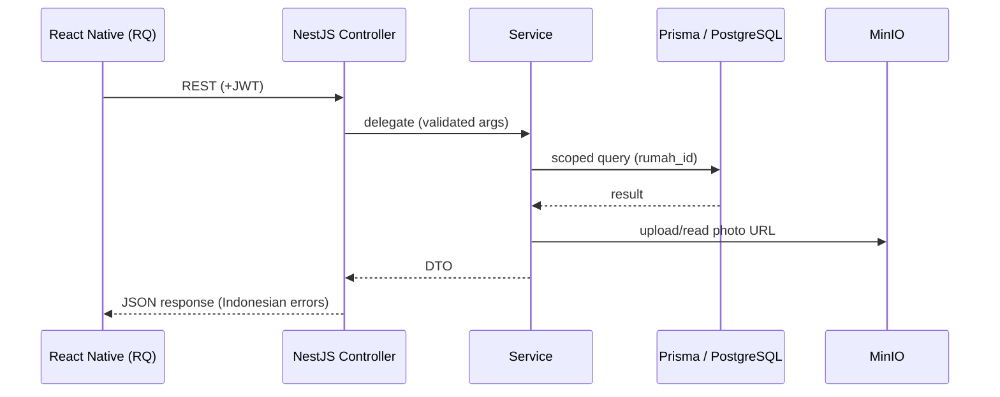
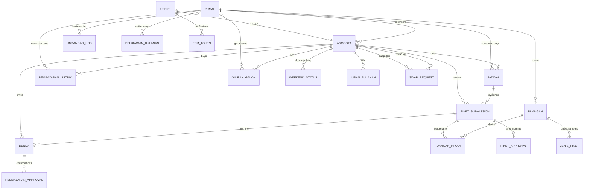
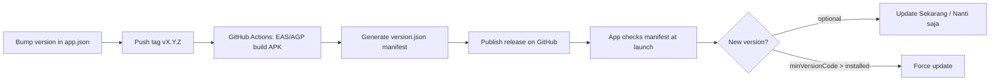
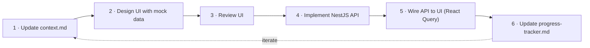
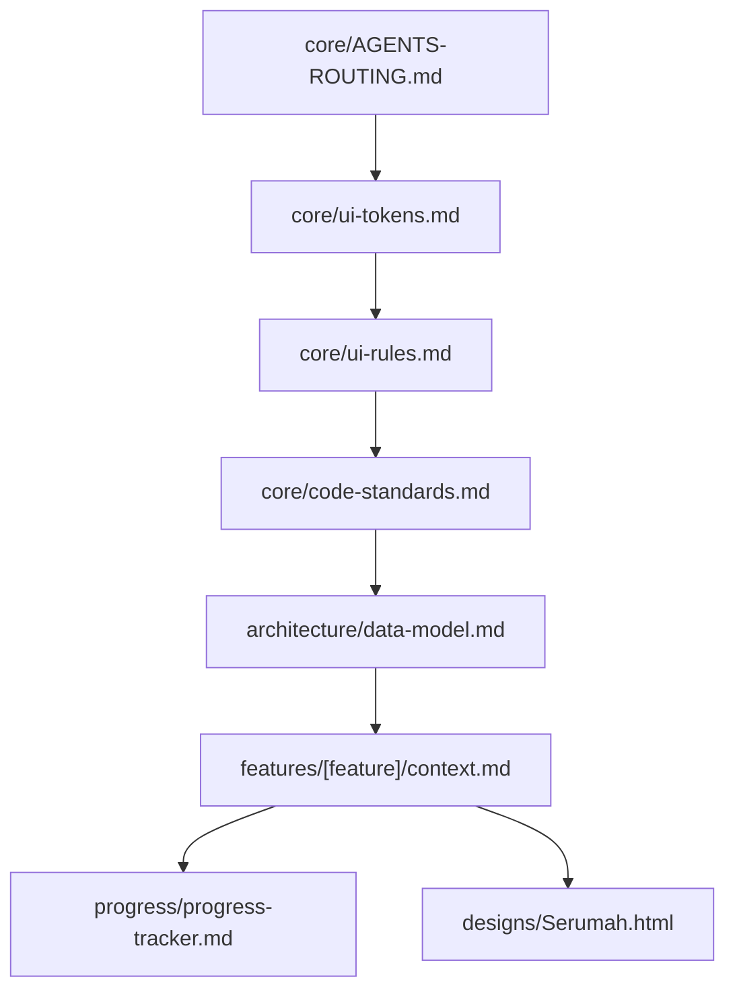

# Serumah — Papan Piket Digital (Piket Kos App)

**Serumah** is a mobile app that digitizes the physical _piket schedule_ — the weekly cleaning rota pinned to the kitchen wall of an Indonesian boarding house (_kos-kosan_). It manages who is on cleaning duty, tracks photo evidence, automatically splits monthly bills, collects and confirms fines (denda), water-gallon turns, and electricity costs — all in one app.

The signature design element is the **stamp / cap motif** (rotated -4°) used exclusively to mark payment & review statuses, echoing the official rubber stamps used on printed kos documents.

> **Language policy:** All UI text is in **Bahasa Indonesia** (the product is for Indonesian users). All source code documentation is in **English**.

---

## Table of Contents

- [Highlights](#highlights)
- [Features](#features)
- [Tech Stack](#tech-stack)
- [Repository Layout](#repository-layout)
- [Architecture](#architecture)
- [Data Model](#data-model)
- [Design System](#design-system)
- [Development (Local)](#development-local)
- [Production](#production)
- [Development Workflow](#development-workflow)
- [Documentation Maps](#documentation-maps)
- [Status & Roadmap](#status--roadmap)
- [To Be Confirmed](#to-be-confirmed)
- [License](#license)

---

## Highlights

- **Round-robin cleaning schedule** — weekday piket on _Senin / Rabu / Jumat_ (every other day) with auto-generated dynamic weekend duty based on members' weekend status.
- **Photo-verified piket** — before → checklist → after photos per room, all stored in MinIO.
- **Auto-fines** — flat fine for missed deadline (20:00), paid via QRIS with PJ confirmation.
- **Auto-split monthly bills** — kos rent, WiFi, and mandatory electricity split equally across members.
- **Extra electricity tracker** — self-recorded tokens that adjust next month's bill.
- **Swap, galon rotation, in-app updates** — plus a full rumah-management console for the admin (PJ Kos).
- **Documentation-driven development** — every feature is described up-front in an English context file before any code (see [Development Workflow](#development-workflow)).

---

## Features

| Area           | Feature           | Description                                                                                         |
| -------------- | ----------------- | --------------------------------------------------------------------------------------------------- |
| **Auth**       | Register & Login  | Email + password, bcrypt hashes, JWT access tokens. Hoped: every user belongs to exactly one rumah. |
| **Onboarding** | Profile → rumah   | Set up profile, then create a rumah (becomes admin) or join one via 6-digit invite code.            |
| **Schedule**   | Round-robin rota  | Weekday Sen/Rab/Jum (Sel/Kam off), no back-to-back, weekend schedule from "Di kos / Pulang" status. |
| **Dashboard**  | Beranda           | Weekend status toggle, galon widget, billing summary, weekly schedule list.                         |
| **Piket**      | Daily execution   | Per-room `before → checklist → after` photos, submit proof.                                         |
| **Verifikasi** | Review            | PJ/anggota approval per submission (all-or-nothing), reject → auto flat fine.                       |
| **Denda**      | Fines & QRIS      | Pay fine, upload proof, PJ confirms; PJ's own fine auto-paid.                                       |
| **Iuran**      | Monthly bills     | Total cost auto-split, payment proof, PJ confirmation, pelunasan (settlement to pemilik).           |
| **Listrik**    | Extra electricity | Self-record token purchases, auto-split, adjusts next month's bill.                                 |
| **Swap**       | Day exchange      | All-or-nothing full-day transfer between members.                                                   |
| **Galon**      | Water rotation    | Galon turn widget + "Sudah Beli" (no reimbursement).                                                |
| **Profile**    | My profile        | Name, photo, emergency contact, address; role badge.                                                |
| **Rumah**      | Management        | Members, costs, rekening, QRIS, invite code reset, rooms & jenis_piket (admin).                     |
| **Update**     | In-app update     | Non-store update via GitHub Releases (`version.json` + APK).                                        |

---

## Tech Stack

| Layer            | Tool                      | Purpose                                     |
| ---------------- | ------------------------- | ------------------------------------------- |
| Mobile framework | **React Native (Expo)**   | Android/iOS app                             |
| Language         | **TypeScript** (strict)   | Whole monorepo                              |
| State (server)   | **React Query**           | Fetch, cache, invalidate, mutations         |
| State (auth/UI)  | **Zustand**               | Auth session + local UI state               |
| Backend          | **NestJS**                | REST API + cron jobs                        |
| Database         | **PostgreSQL + Prisma**   | Single source of truth                      |
| Storage          | **MinIO** (S3-compatible) | Piket photos, avatars, QRIS, payment proofs |
| Auth             | **NestJS + JWT (bcrypt)** | Email + password                            |
| Routing          | **Expo Router**           | File-based routing                          |
| Icons            | **Lucide (React)**        | Consistent icon system                      |
| Package manager  | **Bun**                   | Mono-repo workspaces + scripts              |

---

## Repository Layout

```
house/
├── AGENTS.md                  # Agent behavior rules (read first)
├── context/                   # Documentation-driven specs (English)
│   ├── core/                  #   routing, design tokens, ui rules, code standards
│   ├── architecture/         #   Prisma data model (source of truth)
│   ├── features/<feature>/   #   14 per-feature contexts
│   ├── designs/               #   visual prototypes (open in browser)
│   └── progress/              #   build plan, progress tracker, TBC list
├── packages/
│   └── db/                    # Prisma schema + migrations + seed
├── apps/
│   ├── api/                   # NestJS REST API (self-hosted / Docker)
│   └── mobile/                # Expo React Native app
├── docker-compose.yml         # Postgres 16 + MinIO (local)
└── .env.example               # Environment template
```

---

## Architecture

### High-level flow



### Deployment



### Request flow



---

## Data Model

Defined once in `packages/db/prisma/schema.prisma`; the single source of truth is `context/architecture/data-model.md`.



### Key state machines

| Entity            | Transition                                                                          |
| ----------------- | ----------------------------------------------------------------------------------- |
| `PiketSubmission` | `menunggu → approved \| rejected (→ flat fine) \| bolong (auto, no submit)`         |
| `Denda`           | `belum_bayar → menunggu_konfirmasi → lunas`; PJ's own fine is auto-`lunas` on proof |
| `IuranBulanan`    | `belum_bayar → menunggu_konfirmasi → lunas`; PJ auto-`lunas`                        |
| `SwapRequest`     | `diajukan → diterima (schedule moves) \| ditolak (stays)`                           |
| `GiliranGalon`    | `menunggu → sudah_dibeli → rotate to next member (no nominal)`                      |

---

## Design System

The **Papan Piket Digital** identity — kept and mapped to React Native tokens.

### Palette

| Family           | Tokens                                                                 |
| ---------------- | ---------------------------------------------------------------------- |
| Paper & neutrals | `paperCanvas #DCD6C8`, `paper #EFEAE0`, `card #FBF9F4`, `line #D9D2C0` |
| Ink              | `ink #1E2A24`, `inkSoft #5B6862`, `inkMuted #8B8474`                   |
| Green (primary)  | `pine #3D6B5C`, `pineDeep #2B4E43`, `pineSoft #D7E6DF`                 |
| Red (danger)     | `brick #B33F3F`, `brickDeep #8F2F2F`, `brickSoft #F1DAD5`              |
| Gold (accent)    | `mustard #C9A227`, `mustardSoft #F4E9C8`, `olive #9A8A3A`              |

### Typography

| Role        | Font                         | Usage                          |
| ----------- | ---------------------------- | ------------------------------ |
| Display     | **Space Grotesk** (600/700)  | Headings, stamp caps           |
| Body        | **Inter** (400/500/600)      | Body text, labels              |
| Data / mono | **JetBrains Mono** (400–700) | Rupiah amounts, dates, kickers |

### Signature element: the Stamp

```css
border: 2.5px solid (or dashed for pending)
border-radius: 8px; transform: rotate(-4deg)
font-family: Space Grotesk, 700; letter-spacing: 0.11em
```

Used **only** for the statuses **Lunas / Ditolak / Pending / Approved** — never decoratively.

---

## Development (Local)

> Tooling: **Bun** is required for project creation & package management. Projects are generated via official tooling — never hand-written `package.json`. Native Android builds are **not** done inside WSL — they run on GitHub Actions / EAS.

### Prerequisites

- [Bun](https://bun.sh) (≥ 1.x)
- [Docker](https://www.docker.com/) (for Postgres 16 + MinIO)
- Optional: Android Studio + Android SDK (only for a local dev build)

### 1. Infrastructure (local)

```bash
docker compose up -d          # Postgres 16 + MinIO
cp .env.example .env          # fill DATABASE_URL, JWT_SECRET, MINIO_* etc.
```

### 2. Database (`packages/db`)

```bash
cd packages/db
bun install
bunx prisma migrate dev       # apply schema + generate client
bunx prisma db seed           # seed dev data
```

### 3. API (`apps/api`)

```bash
cd apps/api
bun install
bun run start:dev             # NestJS dev server (http://localhost:3000)
```

### 4. Mobile (`apps/mobile`)

```bash
cd apps/mobile
bun install
bun run start                 # Expo dev server (scan QR with Expo Go)
```

Set the API base URL via `EXPO_PUBLIC_API_URL` in `apps/mobile/.env` (e.g. `http://<your-LAN-ip>:3000` when testing on a physical device).

### Available scripts

| Script                    | Where                     | Purpose                      |
| ------------------------- | ------------------------- | ---------------------------- |
| `bun run start:dev`       | `apps/api`                | Run NestJS API in watch mode |
| `bun run test`            | `apps/api`, `apps/mobile` | Run unit tests               |
| `bun run build`           | `apps/api`                | Build the API for production |
| `bun run lint`            | `apps/mobile`             | Lint the RN app              |
| `bun run start`           | `apps/mobile`             | Start Expo dev server        |
| `bunx prisma migrate dev` | `packages/db`             | Run migrations               |

---

## Production

### 1. Database

Apply migrations to the production database, then run the seed once (if needed):

```bash
cd packages/db
bunx prisma migrate deploy    # apply committed migrations
```

### 2. API (self-hosted NestJS)

The API is self-hosted on a VPS (Docker). Build the image and run it with the production env:

```bash
cd apps/api
bun run build                 # compile NestJS to dist/
docker build -t serumah-api . # or use the provided Dockerfile / compose override
```

Set these env vars in production:

| Var                                                                         | Purpose                                           |
| --------------------------------------------------------------------------- | ------------------------------------------------- |
| `DATABASE_URL`                                                              | PostgreSQL connection string                      |
| `JWT_SECRET`                                                                | Secret for signing access tokens                  |
| `MINIO_ENDPOINT` / `MINIO_ACCESS_KEY` / `MINIO_SECRET_KEY` / `MINIO_BUCKET` | Object storage config                             |
| `EXPO_PUBLIC_UPDATE_MANIFEST_URL`                                           | (mobile build-time) GitHub raw `version.json` URL |

Run scheduled jobs (auto-fine at 20:00, weekend freeze Friday 20:00) with cron inside the container.

### 3. Mobile — build the Android APK

Serumah is **not** on any app store. The APK is distributed via **GitHub Releases** and the app self-updates by checking a `version.json` manifest.



Steps:

1. **Bump the version** in `apps/mobile/app.json` (`expo.version` → version name, `expo.android.versionCode` → version code). Keep `minVersionCode` in the manifest ≤ the lowest still-supported version.
2. **Push a tag** `v{versionName}` — the GitHub Actions workflow builds the APK (EAS build or Android Gradle) and generates `version.json`:

   ```json
   {
     "versionName": "1.0.1",
     "versionCode": 2,
     "minVersionCode": 1,
     "apkUrl": "https://github.com/<owner>/<repo>/releases/download/v1.0.1/serumah-app.apk"
   }
   ```

3. **Publish the release** with `serumah-app.apk` attached.
4. Users' apps detect the newer `versionCode` on launch → show the **Update tersedia** dialog (optional, dismissible) or force update when the installed version is below `minVersionCode`.

Local (non-CI) build for a physical device — via EAS:

```bash
cd apps/mobile
bunx eas-cli build --platform android --profile preview
```

> **Android install permission:** the app requests `REQUEST_INSTALL_PACKAGES` so users can install the downloaded APK. In-app update checks run **only in release mode** (skipped in debug/dev).

---

## Development Workflow

Serumah uses a **documentation-driven, UI-first** workflow:



Rules that always hold:

1. **Docs-first** — update `context/features/<feature>/context.md` before writing code.
2. **No backend integration before UI approval.**
3. **Anti-hallucination:** 1 feature = 1 context; never read other features' specs; unlocked **TBC** → _stop & ask_ the user.
4. **Data model must not drift** — Prisma schema lives in one place; update `data-model.md` first.
5. **Phase gating** — only the active phase is worked on; when a phase completes → stop & ask to proceed.
6. When documentation conflicts with implementation — **documentation wins**.

---

## Documentation Maps

### Read order (agents / contributors)



### Context files

| Path                                    | Contents                                             |
| --------------------------------------- | ---------------------------------------------------- |
| `context/core/AGENTS-ROUTING.md`        | Feature → context map & routing rules                |
| `context/core/ui-tokens.md`             | Design tokens (colors, type, radius, spacing, stamp) |
| `context/core/ui-rules.md`              | UI rules & invariants                                |
| `context/core/code-standards.md`        | NestJS + React Native conventions                    |
| `context/architecture/data-model.md`    | Full Prisma schema + state machines + drift notes    |
| `context/features/<feature>/context.md` | 14 self-contained specs                              |
| `context/designs/*.html`                | Visual prototypes                                    |
| `context/progress/build-plan.md`        | Phased roadmap                                       |
| `context/progress/progress-tracker.md`  | Current status                                       |
| `context/progress/to-be-confirmed.md`   | Unlocked decisions                                   |

---

## Status & Roadmap

| Phase  | Scope                                                                                       | Status                          |
| ------ | ------------------------------------------------------------------------------------------- | ------------------------------- |
| **M0** | Documentation & foundation (docs-first context split)                                       | ✅ M0.1 done · ⏳ M0.2 scaffold |
| **M1** | Release & in-app update pipeline (**first** — testable APKs throughout development)         | ⏳ pending                      |
| **M2** | Backend core (auth, profile, rumah, storage, seed)                                          | ⏳ pending                      |
| **M3** | Backend features (rooms, schedule, piket, fines, iuran, listrik, swap, galon, cron, update) | ⏳ pending                      |
| **M4** | Mobile: auth & onboarding                                                                   | ⏳ pending                      |
| **M5** | Mobile: main tabs (Beranda, Piket, Tagihan, Swap) + profile/rumah                           | ⏳ pending                      |
| **M6** | Final release & E2E (via the update pipeline)                                               | ⏳ pending                      |

> **Release-first (user decision):** the update pipeline is built right after the scaffold so in-app updates can be tested and monitored continuously while the rest of the app is developed — every phase ships an APK that updates in-app.

> Active phase is recorded in `context/progress/progress-tracker.md`. Full detail in `context/progress/build-plan.md`.

---

## To Be Confirmed

Unlocked decisions that must be confirmed by the user before their feature is implemented — see `context/progress/to-be-confirmed.md` for full details:

| #     | Feature     | Open question                                                   |
| ----- | ----------- | --------------------------------------------------------------- |
| TBC-1 | verifikasi  | Rejected piket: auto-fine (design) vs allow revision & resubmit |
| TBC-2 | verifikasi  | **Who may approve/reject** — any member vs admin only           |
| TBC-3 | piket/denda | Storage URLs: permanent public vs signed + expiry               |
| TBC-4 | verifikasi  | Show submission history always vs hidden on off-days            |
| TBC-5 | verifikasi  | History visible to all members vs restricted                    |

---

## License

This project is developed for the Serumah (Piket Kos) initiative. See the project's licensing information before redistribution.
